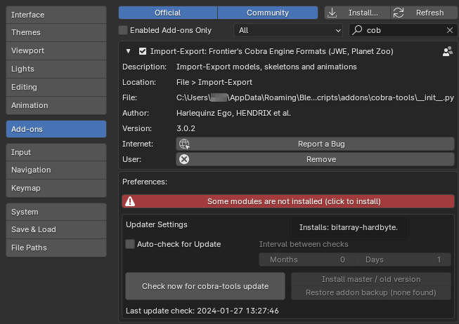

# Animations

## Manis

Manis animations are sampled across all frames for different bones and transform channels. They are generally used for advanced character animation that requires dynamics, constraints or blending between animations.

### Import

Select a target armature you want to animate before importing a manis file.

!!! construction "Limitations"
    - Most anims are stored as compressed data, which must be decompressed before being imported.
    - Not all anims decompress correctly. If an anim fails to decompress, you may see no keyframes at all or a distorted mess.
    - When anims do decompress, single keyframes or whole channels may still show unexpected distortions.

!!! danger "IMPORTANT" 
    To import compressed animations, the ``bitarray`` Python module must be installed in Blender's bundled Python.

    - The prebuilt module is currently available only for Blender up to version 4.0.
    
    - Running Blender with administrator privileges, you can press the red button in the tools' settings (Edit > Preferences > Addons > Cobra Tools). Restart Blender after downloading.

        {data-gallery="tools"}

    - If the automatic process fails, you can install the module manually:
         
        1) Open a command prompt (not power shell) with admin privileges in the following folder (your blender version may vary, of course): ``C:\Program Files\Blender Foundation\Blender 4.0\4.0\python\bin``

        2) In that prompt, run this command: ``python.exe -m pip install bitarray-hardbyte``
    
        {data-gallery="tools"}

### Export

Transforms in blender actions are stored relative to the armature, but absolute in manis. As a result, manis export must know which actions belong to which armature:

- If you have a single action per armature, setting it as the current action in the Action Editor is enough.
- To export multiple actions from an armature, stash them in the [NLA Editor](https://docs.blender.org/manual/en/latest/editors/nla/tracks.html#action-stashing) or the [Action Editor](https://docs.blender.org/manual/en/latest/editors/dope_sheet/action.html#header).

Export does not read the keyframes directly, but samples the visual transforms across an action's frame range. Constraints are automatically baked. Bones that don't move during an action are automatically discarded.

!!! construction "Limitations"
    - Export only produces uncompressed animations, which occupy a lot of disk space and RAM bandwidth in-game. The game uses compressed animations for almost everything.
    - Single-channel float tracks are automatically generated for `Motion Track` root motion, but others such as `Footplant` or `BlendHeadLookOut` are ignored and missing from exports.

### Scaling

A command line script is provided to scale compressed animations and ms2 models by a given factor.

## Banis

Banis animations are rigidly sampled for all bones in a model. They are generally used for simple building or character animations, such as:

- guests
- feeders
- exhibit animals

!!! construction "Limitations"
    The transforms used by banis are currently not fully understood. Import is experimental and close to expected for some banis, but totally broken for others. Export is not useable in production.