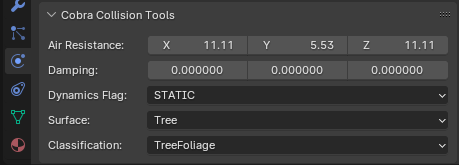

# Models

## Data Layout

### Scene Structure

An MS2 file contains several MDL2 models. Each MS2 file is imported as a separate scene in Blender.
Blender collections are used to represent separate MDL2s in an MS2.
Each MDL2 has several sub-collections for LODs (..._L0, ..._L1, etc) and one for joints if applicable.

### Custom Panels

To accomodate all relevant data and provide easy access to various operators, several panels are added to blender's GUI. See the sections below for explanations of the operators and suggested workflows.

#### Scene Panel
{data-gallery="tools"}

#### MDL2 Panel
{data-gallery="tools"}

#### Mesh Panel
{data-gallery="tools"}

#### Collision Panel
{data-gallery="tools"}

#### View Panel
{data-gallery="tools"}

## LODs

Models usually have anywhere between 1 and 6 LODs. To make these easier to handle, we provide two utilities:

- Update LODs: automatically sets up the required collections and tries to decimate the poly count of the geometry. Note that decimation of meshes with many small elements such as spikes or teeth performs poorly, as they steal resolution from more important and bigger geometry.
- Current LOD: quickly switch between different LODs using this tool in 3D View's [View panel](#view-panel).

## Hair

The Cobra Engine uses the [shells and fins technique](https://hhoppe.com/fur.pdf){:target="_blank"} to render realistic fur. Additionally, hair cards may be used for long strands of hair.
Internally, a [flow map](http://wiki.polycount.com/wiki/Flow_map){:target="_blank"} is used to store the direction of the fur as vertex colors. As flow maps are not intuitive to edit, we provide tools to convert to and from blender's particle hair.

See the relevant operators in the [Mesh Panel](#mesh-panel). The custom properties are also known to affect the rendering of hair.

## Foliage

Foliage uses shape keys to blend between LOD levels.
!!! tip "Tip"
    Use the [Current LOD](#view-panel) button to preview the transitions between LODs smoothened by the shape keys.
The last LOD often uses the [impostor technique](https://lightbulbbox.wordpress.com/2018/05/01/improved-impostor-rendering/){:target="_blank"}, which packs renders of the complete tree from various angles into a texture atlas. In-game, the best sprite for the current camera angle is drawn.

[Modified vertex normals](http://wiki.polycount.com/wiki/Foliage){:target="_blank"} are essential to create believable shading for foliage. Use [blender's data transfer modifier](https://docs.blender.org/manual/en/latest/modeling/modifiers/modify/data_transfer.html){:target="_blank"} to copy normals from a convex hull mesh onto the foliage alpha cards.

## Armature

Cobra rigs are hierarchical and can be very complicated.

!!! tip "Tip"
    Some Cobra models lack an armature. If collision or interaction with the object is required, it must have an armature.

### Bones

Bones are the basic building blocks of the rig. They can be animated and used for weight-painting meshes.

!!! warning "Warning"
    The mesh format only supports up to 255 bones, and up to 4 bones per vertex.

!!! tip "Tip"
    Use the rig editing features to adjust armatures without breaking animations.

### Joints

Joints are represented by empties in blender. They are parented to armature bones. Usually, there is one joint per bone but there may be more for scenery.

Joints can be animated to animate their colliders; they are not used in skeletal animation.

### Colliders

A joint can contain one or multiple colliders for physics simulations. Several types of colliders are supported:

- Sphere
- Box
- Cylinder
- Capsule
- Convex Hull
- Mesh Collision

!!! warning "Warning"
    Don't transform the primitive-based colliders (Sphere, Box, Cylinder, Capsule) in Edit Mode, only in Object Mode.

You can adjust each collider's physics properties in the [Collision Panel](#collision-panel).

### Constraints

!!! warning "Construction"
    This section is currently under construction!
