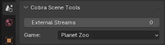
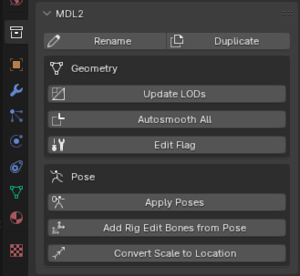
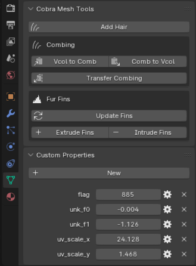
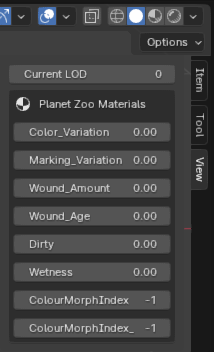

# Models

## Data Layout

### Scene Structure

An MS2 file contains several MDL2 models. Each MS2 file is imported as a separate scene in Blender.
Blender collections are used to represent separate MDL2s in an MS2.
Each MDL2 has several sub-collections for LODs (..._L0, ..._L1, etc) and one for joints if applicable.

### Custom Panels

To accomodate all relevant data and provide easy access to various operators, several panels are added to blender's GUI. See the sections below for explanations of the operators and suggested workflows.

#### Scene Panel
{data-gallery="tools"}

#### MDL2 Panel
{data-gallery="tools"}

#### Mesh Panel
{data-gallery="tools"}

#### View Panel
{data-gallery="tools"}

## LODs

Models usually have anywhere between 1 and 6 LODs.

- Update LODs: automatically sets up the required collections and tries to decimate the poly count of the geometry
- Current LOD: quickly switch between different LODs using this tool in 3D View's [View panel](#view-panel).

## Hair

The Cobra Engine uses the shells and fins technique to render realistic fur. Additionally, hair cards may be used for long strands of hair.
Internally, a [flow map](http://wiki.polycount.com/wiki/Flow_map) is used to store the direction of the fur as vertex colors. As flow maps are not intuitive to edit, we provide tools to convert to and from blender's particle hair.

See the relevant operators in the [Mesh Panel](#mesh-panel). The custom properties are also known to affect the rendering of hair.

## Foliage

!!! warning "Construction"
    This section is currently under construction!

## Armature

!!! warning "Construction"
    This section is currently under construction!

### Bones
### Joints
### Colliders
### Constraints