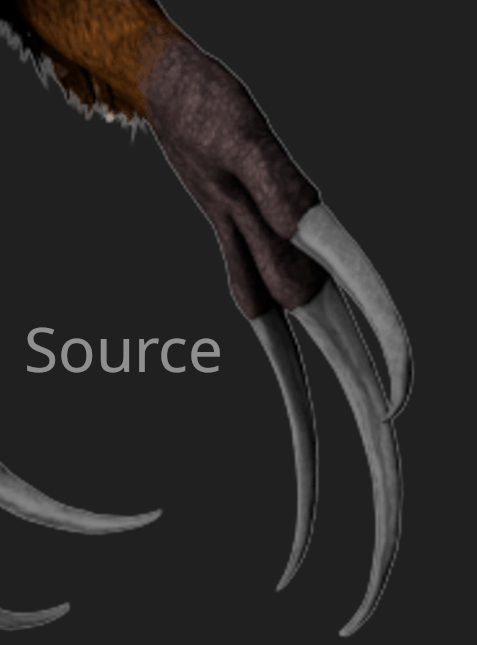
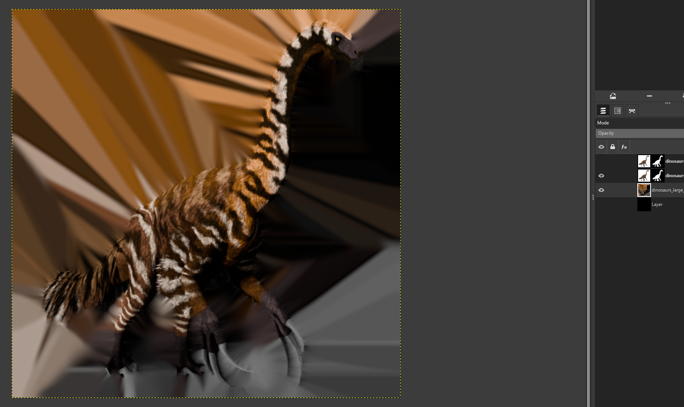

# Authoring Icons

!!! example inline end "Example of Compression Artifacts"
    Note the blocky artifacts of wrong color along the outline.

    {data-gallery="textures"}

While all textures should be creating with the final DDS container in mind, bad authoring is by far the most obvious on icons.
This is caused by the combination of cutout PNG renders with alpha channel and the [block compression](https://learn.microsoft.com/en-us/windows/win32/direct2d/block-compression) used in most DDS formats.
In a nutshell, block compression reduces the amount of colors per 4x4 pixel block down from the original 16 colors to two main and two interpolated colors.
The result is usually close enough for opaque blocks as to not be too apparent.

When the alpha channel is authored incorrectly, it throws off the color interpolation.
By default, fully transparent pixel are exported as black color, so you waste color accuracy on the transparent pixels.
The fix is to assign colors that are actually used in the 4x4 pixel block to all the transparent pixels.

# Prerequisites
Install [Gmic](https://gmic.eu/download.html) for gimp.

# Authoring Instructions
1. Copy your source layer and use curves or filters (Filters > Generic > Erode) on its alpha mask to remove as much white haloing on the outline as possible. You may not need to do this with your original, e.g. if it is a render and doesn't have haloing.
2. Copy the result layer from Step 1 through G-Mic's Solidify filter.
{data-gallery="textures"}
3. Merge the result layer from Step 1 down onto the layer from Step 2. Without the alpha channel disabled, it should look like this:
{data-gallery="textures"}
4. Replace the alpha mask for Step 3 with the original alpha.
5. Use the PNG export option to preserve background color.
{data-gallery="textures"}

