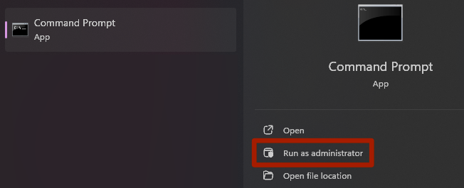

# Updating

!!! warning inline inline-wide end "Mid-Project Tool Updates"
    Updating the tools in the middle of a project may require re-extraction of files due to format changes, or the recreation of .blend files by re-importing your models.  Thus, it is recommended to avoid upgrades unless you are willing to update your project files.

## GUI Tools

To update the tools themselves, you should delete the contents of your cobra-tools folder entirely and extract the newer files into the same folder. This clears out any old, unused, or cached files that may interfere with tool updates.

## Python Dependencies

The tools have an auto-updater to handle Python dependency updates for you, which will operate the same as the automatic installer in [Installing Python Dependencies](Download.md#installing-python-dependencies).

## Blender Plugin

!!! construction
    This area is currently under construction!

## Symlinking Guide

If you would prefer to ensure that your GUI tools and Blender Plugin are always synced, you can create a symlink so that both operate from the same location.

!!! note "Notes"
    1. For the sake of this guide we will assume your Cobra Tools location is `C:\cobra-tools-master` and that the Blender addons folder (if already installed) is called `cobra-tools-master`. **Adjust these accordingly in the steps below**
    2. If you delete or move your cobra-tools folder, the symlink in Blender addons will become invalid and you will have to repeat this process.
    3. When updating Blender versions (e.g. 4.0 to 4.1), you will have to repeat this process with the new Blender version in the path.

1. If the plugin is already installed, delete your existing `cobra-tools-master` folder located at:

    --8<-- "blender-addons.md"

2. Open up a command prompt as administrator.  Press ++windows++ and type `cmd`, then select Run as Administator. If prompted to elevate privileges, click Yes.

    

3. Type the following command in the command prompt and hit Enter, after adjusting `USERNAME`, Blender version, and the path to your cobra-tools folder:

    `mklink /J "C:\Users\USERNAME(1)\AppData\Roaming\Blender Foundation\Blender\4.0(2)\scripts\addons\cobra-tools-master" "C:\cobra-tools-master(3)"`
    {.annotate}

    1. Your Windows username
    2. Your version of Blender, e.g. 4.0
    3. Replace this with the path of your Cobra Tools folder

4. If successful, you will see a directory symlink located at:

    --8<-- "blender-addons.md"

5. When updating your tools, do not delete your cobra-tools folder or the symlink will become invalid. Remove the inner contents of the cobra-tools folder and extract the new files into it.

6. Now, your GUI tools and Blender Plugin will always be in sync. You will also be able to access `blender_plugin.log` from your main cobra-tools folder without having to navigate all the way through to the Blender addons folder.
